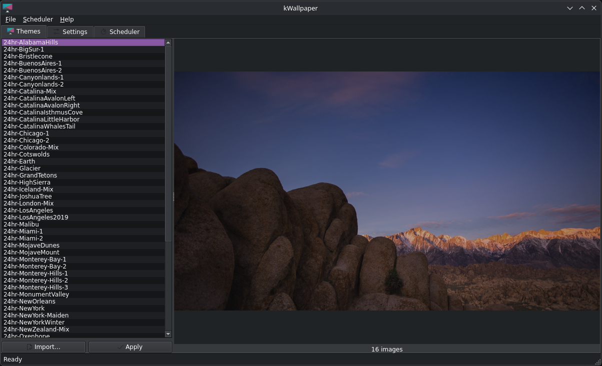
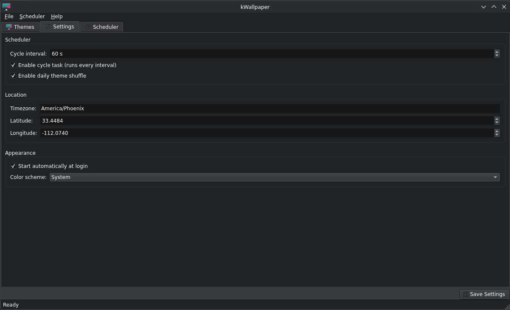

# kWallpaper

⚠️ **KDE Plasma 6 / Linux Only** — This application requires KDE Plasma 6 and will not work on other desktop environments or operating systems. (The core is toolkit-agnostic, so the GUI could be ported to GTK/other frameworks, but out of the box it uses PyQt6 for native KDE integration.)

A native-styled KDE Plasma 6 application that automatically changes your wallpaper based on time-of-day, driven by `.ddw` (wallpaper theme) zip files. It features an instant, thumbnail-backed cross-fade preview, background scheduler controls, system tray integration, and a single-instance GUI.

Works with themes from [24hr Wallpaper](https://www.jetsoncreative.com/24hourwindows) (Jetson Creative's `.ddw` format) — you can also create your own themes.

> This project was vibe-coded with Qwen3-Coder-Next and GLM-4.7-Flash; the GUI was created in one prompt with Claude Opus 4.6. The author missed [24hr Wallpaper](https://www.jetsoncreative.com/24hourwindows) after moving from macOS to KDE and built their own.


*Theme selector tab showing imported themes with cross-fade preview*


*Settings tab with scheduler configuration and location/timezone coordinates*

## Features

### GUI
- **Instant theme previews** — 1080p JPEG thumbnails are generated and decoded off the GUI thread (`QThreadPool` workers); the cross-fade widget only ever renders thumbnails, never full-resolution 4K images. Selecting a theme shows a first frame in milliseconds, with no event-loop jank.
- **Theme management** — Import `.ddw`/`.zip` themes, browse, and delete them. Import/delete/apply all run in background workers so the UI never freezes, even on large `.ddw` files.
- **Cross-fade preview** — Smooth animated transitions between theme images, with a pre-scaled pixmap cache (scaled once per image, invalidated only on resize).
- **Scheduler tab** — Start/stop the background scheduler, view status, and follow a live event log.
- **System tray** — Quick start/stop, show/hide window, theme-aware light/dark tray icons.
- **Single instance** — Launching a second copy focuses the running window instead of starting a second app.
- **Auto-start** — Optional "start at login" (writes a `~/.config/autostart` desktop entry) and "start scheduler on app launch".
- **Native KDE integration** — Breeze color scheme, system icons, configurable appearance (system/light/dark).

### Time-based wallpaper selection
- Accurate dawn/sunrise/sunset/dusk calculations via the [Astral](https://pypi.org/project/astral/) library.
- One single source of truth for all period math (`kwallpaper/suntime.py`), shared by the GUI, CLI, and scheduler.
- Configurable location (city, latitude, longitude, IANA timezone) with auto-detect.
- Image selection based on position within the current time-of-day period.

### Background scheduler
- `cycle_task` — interval-based (default every 60 s), re-applies the correct image for the current time-of-day.
- Daily theme shuffle — checked on every cycle run: if the local date differs from the persisted `last_change_date`, the shuffler advances to the next theme and applies it. No midnight cron job, so a missed midnight (suspend, reboot, app not running at 00:00) is picked up on the next cycle run.
- Shuffle state (`shuffle-list.json`) is only persisted after the wallpaper change succeeds, so a failed change retries the same theme instead of skipping it.
- A lock prevents overlapping runs; every run is logged to the GUI event log.
- Daily shuffle list management with atomic single-writer state (`shuffle-list.json`).

## Architecture

The original ~2,700-line `wallpaper_changer.py` god module was split into focused modules (phases 0–5 of the code-review plan are implemented):

```
kwallpaper/
├── __init__.py               # Package init
├── config.py                 # Paths, load/save/validate, one-time dir bootstrap
├── backup.py                 # Daily astral schedule backup
├── suntime.py                # ONE implementation of dawn/sunrise/sunset/dusk math
├── selection.py              # Image file/index selection (theme.json + glob)
├── themes.py                 # Discovery, extraction, import/delete, thumbnails
├── wallpaper.py              # Plasma D-Bus wallpaper application (gdbus)
├── shuffle_list_manager.py   # Daily shuffle list state (single writer)
├── scheduler.py              # APScheduler manager (daily cron + interval cycle)
├── core.py                   # High-level API: apply_theme / import_theme /
│                             #   delete_theme / set_wallpaper (used by CLI + GUI)
├── cli.py                    # Pure argparse dispatch (run_*_command, main)
└── wallpaper_changer.py      # Compatibility facade re-exporting the old API
```

Design notes:

- **`core.py` is the clean API.** Both the CLI (`cli.py`) and the GUI call `apply_theme()`, `import_theme()`, `delete_theme()`, and `set_wallpaper()`. `apply_theme()` owns the config read-modify-write and shuffle-list state atomically.
- **No GUI-thread I/O.** All blocking work (JSON I/O, astral math, D-Bus calls, zip extraction, thumbnail generation, image decoding) runs in `QThreadPool` workers (`_OpWorker`, `_ThumbnailWorker`, `_PixmapLoader`).
- **`wallpaper_changer.py` remains only as a compatibility facade** so existing `from kwallpaper.wallpaper_changer import X` imports keep working.
- **Config is loaded/saved once per operation** — `ensure_config_dirs()` is idempotent and does filesystem work only once per process.

## Requirements

- **Python 3.10+** (Python 3.12/3.13 for Flatpak builds)
- **KDE Plasma 6** (any recent version)
- **Linux distribution with KDE Plasma** (Fedora, Ubuntu, Arch, etc.)

### System Commands
- `gdbus` — Plasma D-Bus calls for setting/querying the wallpaper (per-screen `org.kde.plasmashell`)
- `pgrep` — Checking if Plasma is running

### Python Dependencies
```bash
pip install -r requirements.txt
```
Runtime: `astral`, `apscheduler`, `PyQt6`. Dev: `pytest`, `pytest-cov`.

## Installation

### From PyPI (Recommended)
```bash
pip install kwallpaper-changer
```

### From Source
```bash
git clone <repository-url>
cd kwallpaper
pip install -r requirements.txt
python wallpaper_gui.py
```

### Flatpak
A Flatpak bundle is available with all Python dependencies embedded (Python 3.12, `org.kde.Platform` 6.9 runtime):

```bash
cd flatpak
./build.sh
flatpak install --user bundle/top.spelunk.kwallpaper.flatpak
```

## Configuration

### Config File Location
Default: `~/.var/app/top.spelunk.kwallpaper/config/kwallpaper/config.json`

```json
{
  "interval": 5400,
  "retry_attempts": 3,
  "retry_delay": 5,
  "scheduling": {
    "interval": 60,
    "run_cycle": true,
    "daily_shuffle_enabled": true,
    "auto_start_on_launch": false
  },
  "location": {
    "city": "Phoenix",
    "latitude": 33.4484,
    "longitude": -112.074,
    "timezone": "America/Phoenix"
  },
  "application": {
    "theme_mode": "system",
    "autostart": false
  },
  "theme": {
    "last_applied": "theme-name"
  }
}
```

### Configuration Fields

| Field | Type | Description |
|-------|------|-------------|
| interval | integer | Seconds between wallpaper changes (default: 5400 = 1.5 hours) |
| retry_attempts | integer | Retry attempts on failure (default: 3) |
| retry_delay | integer | Delay between retries in seconds (default: 5) |
| scheduling.interval | integer | Scheduler cycle interval in seconds (default: 60) |
| scheduling.run_cycle | boolean | Enable interval cycle task (default: true) |
| scheduling.daily_shuffle_enabled | boolean | Enable daily theme shuffle at midnight (default: true) |
| scheduling.auto_start_on_launch | boolean | Start the scheduler when the GUI launches (default: false) |
| location.city | string | City name (display only) |
| location.timezone | string | IANA timezone string (e.g., `America/Phoenix`) |
| location.latitude | float | Latitude for sunrise/sunset calculations |
| location.longitude | float | Longitude for sunrise/sunset calculations |
| application.theme_mode | string | Color scheme: system/light/dark (default: system) |
| application.autostart | boolean | Start kWallpaper automatically at login (default: false) |
| theme.last_applied | string | Last applied theme folder name |

Other paths (all under `~/.var/app/top.spelunk.kwallpaper/`):

| Path | Purpose |
|------|---------|
| `config/kwallpaper/config.json` | Main config |
| `config/kwallpaper/themes/` | Imported themes (one directory per theme) |
| `config/kwallpaper/shuffle-list.json` | Daily shuffle list state |
| `cache/kwallpaper/thumbs/` | Generated 1080p preview thumbnails |
| `cache/kwallpaper/schedule-backup/` | Daily astral schedule backups |

### Time-of-Day Categories
The Astral library computes four values (dawn, sunrise, sunset, dusk) for your location. All period boundaries are derived from them in one place (`suntime.py`):

- **night**: from dusk until dawn − 30 min (spans midnight)
- **sunrise**: from dawn − 30 min until sunrise + 45 min
- **day**: from sunrise + 45 min until dusk − 45 min
- **sunset**: from dusk − 45 min until dusk

### Image Indexing
Images are numbered 1–16 in the theme. Normalization ensures:
- Image 1 is always in the sunrise category (last 30 minutes before dawn)
- Images 2–4 are in the sunrise category
- Images 5–9 are in the day category
- Images 10–13 are in the sunset category
- Images 14–16 are in the night category

## Quick Start

1. **Launch the application:**
   ```bash
   python wallpaper_gui.py
   ```
2. **Import a theme:** click **Import** in the Themes tab and select a `.ddw` or `.zip` file — it is extracted in a background worker.
3. **Apply a theme:** select a theme from the list and click **Apply** (runs in a worker; the button shows a busy state).
4. **Start the scheduler:** Scheduler tab → **Start** for automatic rotation.
5. **Configure:** interval, location/timezone, appearance, and auto-start options live in the Settings tab.

## GUI Interface

### Themes Tab
- **Import** — Import `.ddw` or `.zip` theme files (background worker)
- **Theme list** — Browse available themes with image counts
- **Preview** — Live cross-fade preview from 1080p thumbnails (background decode)
- **Apply** — Apply selected theme immediately (background worker)
- **Delete** — Remove a theme (background worker)

### Settings Tab
- **Scheduler** — Interval, cycle behavior, daily shuffle, start-on-launch
- **Location** — Timezone and coordinates for accurate sun calculations, with auto-detect
- **Appearance** — Override KDE color scheme (system/light/dark)
- **Auto-start** — Start at login (writes `~/.config/autostart` entry)

### Scheduler Tab
- **Start/Stop** — Control background scheduler
- **Status** — Current scheduler state (via `get_status()`)
- **Event Log** — Live scheduler events and errors

### System Tray
- Quick start/stop scheduler
- Show/hide main window
- Theme-aware light/dark icon

## Usage

### Launch GUI
```bash
python wallpaper_gui.py
```

### Launch CLI
```bash
python wallpaper_cli.py
```

CLI commands (dispatched by `kwallpaper/cli.py`):

```bash
# Extract a theme from a .ddw file
python wallpaper_cli.py extract --theme-path /path/to/theme.ddw --cleanup

# Change wallpaper to the next image
python wallpaper_cli.py change --theme-path /path/to/theme.ddw

# Cycle to the next image based on current time
python wallpaper_cli.py cycle

# Print current shuffle list state
python wallpaper_cli.py shuffle-list

# List available images in a time-of-day category
python wallpaper_cli.py list --time-of-day day

# Check current wallpaper
python wallpaper_cli.py status

# Manage themes
python wallpaper_cli.py themes list
python wallpaper_cli.py themes add --source /path/to/theme.ddw
python wallpaper_cli.py themes remove --theme-path /path/to/theme
python wallpaper_cli.py themes reshuffle
```

## Troubleshooting

### Plasma Not Running
Error: "Plasma is not running"

Ensure KDE Plasma is running:
```bash
pgrep -x plasmashell
```

### Theme Import Fails
Error: "theme.json not found in zip file"

Verify the `.ddw` file is valid:
```bash
unzip -l theme.ddw | grep "\.json"
```

### Scheduler Won't Start
1. Check APScheduler is installed: `pip install apscheduler`
2. Verify Plasma is running: `pgrep -x plasmashell`
3. Check the event log in the Scheduler tab

### Color Scheme Issues
- Try different theme modes in Settings: System/Light/Dark
- Restart the application after changing theme mode
- Check KDE System Settings → Appearance

## FAQ

### Q: Does it work with other desktop environments?
A: No — it is designed specifically for KDE Plasma 6. The core modules are toolkit-agnostic, so the GUI could be adapted to other desktops, but wallpaper application uses Plasma's D-Bus API.

### Q: Can I use multiple themes?
A: Yes — import as many themes as you like. The daily shuffle rotates through them automatically, or switch manually with Apply.

### Q: How does time-of-day selection work?
A: The Astral library computes dawn/sunrise/sunset/dusk for your location. The day is divided into four periods (night, sunrise, day, sunset) with fixed transition offsets (30 min before dawn, 45 min after sunrise, 45 min before dusk). Within each period, the image is chosen by your current position in the period. All of this lives in one module (`kwallpaper/suntime.py`).

### Q: Can I customize the time ranges?
A: The offsets are constants in `kwallpaper/suntime.py` (documented in its module docstring, with the legacy per-selector quirks pinned by tests).

### Q: Does it support animated wallpapers?
A: No — static JPEG/PNG images only.

### Q: Can I use this with Flatpak?
A: Yes — a Flatpak bundle is provided (see above). The app stores everything under `~/.var/app/top.spelunk.kwallpaper/` and talks to Plasma over the session D-Bus.

### Q: How do I uninstall?
```bash
pip uninstall kde-wallpaper-changer
rm -rf ~/.var/app/top.spelunk.kwallpaper
```

### Q: Can I run this as a non-root user?
A: Yes — you should run it as your regular user. It only writes to your home directory.

### Q: What if a wallpaper change fails?
A: The operation is retried per `retry_attempts`/`retry_delay` in config, failures are logged to the scheduler event log, and the CLI exits non-zero. Check Plasma status and the event log for the root cause.

## Development

### Running Tests
```bash
python3 -m pytest tests/ -v
```
134 tests cover the astral/period math (`suntime`, full-day and edge-case detection), config load/save/validation round-trips, theme zip extraction, the core API, scheduler behavior (daily cron, no-op guard, lock), and GUI operations.

### Project Structure
```
kwallpaper/
├── wallpaper_gui.py              # Main GUI application (~1,700 lines, worker-based)
├── wallpaper_cli.py              # CLI entry point
├── kwallpaper/
│   ├── __init__.py               # Package init
│   ├── config.py                 # Config paths, load/save/validate
│   ├── backup.py                 # Daily schedule backup
│   ├── suntime.py                # Astral time-of-day math (single source of truth)
│   ├── selection.py              # Image file/index selection
│   ├── themes.py                 # Theme discovery/extraction/import/delete/thumbs
│   ├── wallpaper.py              # Plasma D-Bus wallpaper application
│   ├── shuffle_list_manager.py   # Daily shuffle list state
│   ├── scheduler.py              # APScheduler manager
│   ├── core.py                   # High-level API (CLI + GUI)
│   ├── cli.py                    # argparse dispatch
│   └── wallpaper_changer.py      # Compatibility facade (legacy imports)
├── tests/
│   ├── test_astral_time_detection.py
│   ├── test_full_day_astral.py
│   ├── test_suntime.py
│   ├── test_config.py
│   ├── test_config_validation.py
│   ├── test_core_api.py
│   ├── test_zip_extraction.py
│   ├── test_helper_functions.py
│   ├── test_scheduler.py
│   ├── test_scheduler_autostart.py
│   ├── test_gui_autostart.py
│   ├── test_gui_ops.py
│   ├── test_location_autodetect.py
│   └── test_wallpaper_change.py
├── flatpak/                      # Flatpak manifest, build scripts, bundled repo
├── icons/                        # Theme-aware app/tray icons
├── screenshots/                  # README screenshots
├── requirements.txt              # Python dependencies
├── setup.py                      # PyPI packaging
├── top.spelunk.kwallpaper.desktop
├── top.spelunk.kwallpaper.autostart.desktop
├── top.spelunk.kwallpaper.metainfo.xml
└── README.md                     # This file
```

## License

This project is provided as-is for personal use.

## Acknowledgments

- **KDE Plasma** — Plasma D-Bus wallpaper API
- **Astral Library** — Accurate sunrise/sunset calculations
- **PyQt6** — Native KDE Plasma integration and modern UI components
- **APScheduler** — Background scheduler for continuous operation

## Changelog

### Version 1.1.0 (Current)
- **Instant scene selection** — 1080p thumbnail pipeline with off-GUI-thread generation and decode; pre-scaled pixmap cache; no full-resolution JPEG touches on the GUI thread
- **Background workers** — Apply/Import/Delete run in `QThreadPool` workers with busy-state UI; no more GUI freezes
- **Module split** — the 2,700-line `wallpaper_changer.py` god module is now focused modules (`config`, `suntime`, `selection`, `themes`, `wallpaper`, `core`, `cli`, `backup`) with a compatibility facade
- **Single source of truth for time math** — one period model in `suntime.py`, legacy per-selector quirks pinned by tests
- **Scheduler correctness** — daily shuffle is checked on every cycle run (date change since `last_change_date`), so missed midnights are picked up automatically; job-overlap lock; live event log in the GUI
- **Correctness fixes** — configured lat/lon used in CLI time selection; `themes remove` deletes directories properly; scheduler status via public API; theme-aware tray icons
- **Auto-start** — optional start-at-login and start-scheduler-on-launch
- **Flatpak** — bundled build with embedded Python dependencies (Python 3.12, org.kde.Platform 6.9)

### Version 1.0.0
- Full GUI application with native KDE Plasma 6 integration
- Cross-fade image preview widget
- System tray integration
- Scheduler with event logging
- Daily theme shuffle support
- Multiple tab interface (Themes, Settings, Scheduler)
- Configurable color scheme (system/light/dark)
- Background wallpaper rotation
